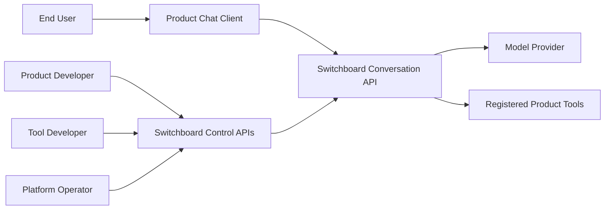
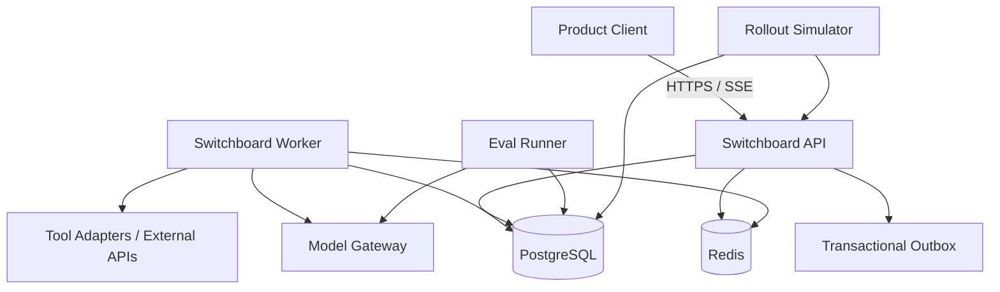
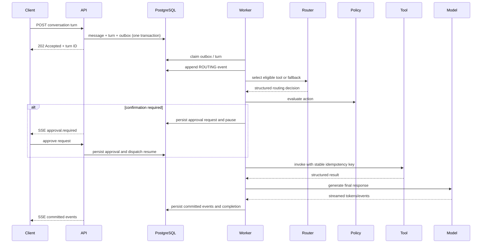
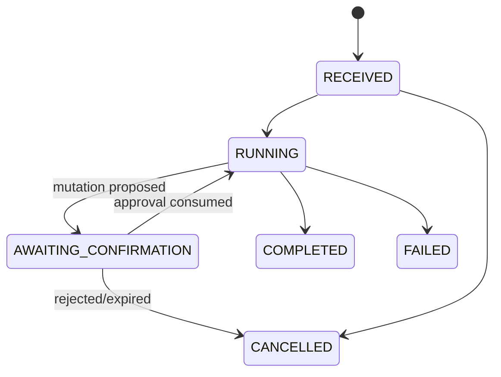
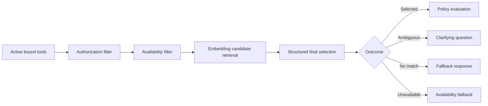
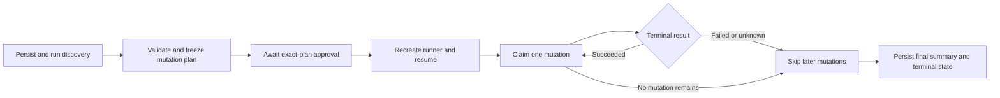

# Architecture

## Architectural style

Switchboard begins as a **modular monolith with a separate background worker**. This provides strong transactional boundaries and simple local operation while preserving modules that could later become independently deployed control-plane or data-plane services.

LangGraph is an orchestration adapter. Switchboard owns the public execution model, state machine, persistence, APIs, and guarantees.

## System context



## Target container view

This diagram includes later outbox, model, tool, evaluation, and rollout
components. The current Phase 1 deployment subset is listed below.



## Control plane and data plane

### Control plane

- agent and tool registration;
- policy configuration;
- eval dataset and evaluator management;
- release creation and rollout transitions;
- disabling unhealthy tools;
- inspection and audit APIs.

### Data plane

- accept conversation turns;
- persist and dispatch work;
- load context;
- route tools;
- evaluate policies;
- wait for approval;
- invoke tools;
- call models;
- stream committed events;
- recover from retries and failure.

They initially share one codebase and database but have separate modules and contracts.

## Proposed modules

```text
src/switchboard/
├── domain/
│   ├── agents/
│   ├── conversations/
│   ├── execution/
│   ├── tools/
│   ├── policies/
│   ├── evaluation/
│   └── releases/
├── application/
│   ├── commands/
│   ├── queries/
│   ├── ports/
│   └── services/
├── adapters/
│   ├── api/
│   ├── persistence/
│   ├── orchestration/
│   ├── models/
│   ├── tools/
│   ├── streaming/
│   └── telemetry/
├── workers/
└── bootstrap/
```

## Target runtime turn flow

The following end-to-end outbox, worker, routing, policy, tool, and model flow is
the target architecture. Through Day 10, durable events/SSE, context, registry,
conversation acceptance, bounded orchestration, policy, approval, and
PostgreSQL-owned sequential workflows are implemented without the target outbox
or automatic worker claiming.



## Durable dispatch

Target architecture, not yet implemented: the API transaction will commit:

1. user message;
2. `TurnExecution` in `RECEIVED`;
3. initial execution event;
4. outbox record.

The future worker will claim outbox records and advance the state machine. Day 9
durably accepts a message, turn, pending attempt, and command receipt, but does
not yet provide the transactional outbox, durable claiming, or recovery.

## Conversation API

The implemented `/api/v1` boundary exposes create/continue commands,
conversation metadata, exclusive-cursor message history, turn inspection,
approval read/decision commands, and the event stream. Pydantic transport models and stable error envelopes
are separate from domain entities and SQLAlchemy records; routes delegate to
application services and issue no SQL.

Every operation requires an explicit `X-Team-ID` UUID. It is a development
ownership context, not authentication. Commands also require an opaque
`Idempotency-Key`. PostgreSQL command receipts store its SHA-256 hash, a
versioned canonical request fingerprint, and immutable result identifiers.
Receipt uniqueness serializes duplicate commands; the receipt and accepted
conversation graph commit in the same unit of work. Identical replay returns
the original result, while conflicting reuse is rejected.

Approval decisions additionally require a development `X-Actor-ID`. Day 8
single-invocation decisions have durable command receipts scoped to team and
approval. Workflow-plan decisions are lifecycle-idempotent but do not yet have a
generalized cross-approval command-receipt authority. Safe reads identify an
`invocation` or `workflow_plan` target additively and expose no argument values
or fingerprint digest.

`202 Accepted` means the message, received turn, pending attempt, and receipt
are durable. It does not mean execution started. No route launches background
work; tests invoke the deterministic runner explicitly when they need terminal
events. A transactional outbox remains necessary to bridge acceptance to
automatic durable dispatch.

## Execution state machine



This is the implemented public turn lifecycle. Day 9 represents uncertain
post-dispatch mutation outcomes on the invocation, workflow step, and workflow;
it safely fails the public turn rather than adding a nonterminal public turn
state. Semantic routing, clarification, automated recovery, and reconciliation
remain target capabilities.

## Tool-routing pipeline



## Policy boundary

The policy engine receives a complete request context and returns one of:

- `ALLOW`;
- `DENY`;
- `REQUIRE_CONFIRMATION`;
- `REQUIRE_ELEVATED_APPROVAL`.

The pure `day8-v1` evaluator allows valid read-only calls, requires confirmation
for valid mutations, and denies external-side-effect and privileged calls.
Approvals are separate durable records linked to immutable policy evaluations
and exact invocations. `action-v1` fingerprints team, requester, pinned
versions, effect, environment, policy version, and canonical arguments. Public
summaries contain argument field names but no values or digest.

## Tool execution contract

Each invocation includes:

- immutable tool version;
- validated arguments;
- stable logical invocation ID and idempotency key;
- caller identity and delegated scopes;
- timeout and retry policy;
- trace context.

Each result maps to a platform error taxonomy. A timeout after dispatch of a mutation may become `UNKNOWN_OUTCOME`; it is not blindly retried.

## Streaming model

SSE is used because the primary direction is server-to-client event delivery.
Implemented events have monotonically increasing turn-local sequence numbers
allocated under a PostgreSQL turn-row lock. A reconnecting client supplies a
non-negative `Last-Event-ID`; the API treats it as an exclusive cursor, replays
committed events in order, and then follows newly committed events.

The execution services emit stable `response.delta` chunks rather than exposing
provider token objects. Day 9 adds non-turn-terminal `workflow.planned`,
`workflow.resumed`, and `workflow.terminal` observations to the approval,
tool, and turn event catalog. Events contain no
arguments, results, fingerprint digest, exceptions, prompts, or private
reasoning. A framework-independent replay service polls PostgreSQL
with short independent units of work, never sleeps or yields with a transaction
open, and closes after a terminal event. Redis is not required for correctness;
notification-assisted polling remains a future optimization.

`GET /api/v1/turns/{turn_id}/events` is read-only. Disconnecting or cancelling
one observer does not mutate execution or affect another observer. Production
retention and chunk-size tuning remain undefined.

## Context management

Every immutable `AgentVersion` owns a typed `ContextPolicy`: total model-window
tokens, reserved output, fixed instruction/tool overhead, maximum summary size,
and a mandatory recent-message floor. The application computes conversation
capacity as the model window minus reserved output and fixed overhead. It fails
explicitly when mandatory context cannot fit.

`BuildTurnContext` reconstructs a turn from messages only through that turn's
input-message sequence. A deterministic assembler keeps the newest contiguous
suffix and, when required, represents the omitted prefix with an immutable
`ConversationSummary`. Summaries start at sequence 1 and record conversation,
agent version, coverage, summarizer version, token-counter version, token count,
and creation time. They are derived artifacts, not visible conversation
messages or authorization evidence.

Snapshot reads, compatible-summary lookup, summarization, and summary writes use
separate boundaries. No database transaction remains open while a summarizer is
running. PostgreSQL uniqueness selects one authoritative artifact when
concurrent builders summarize the same provenance and coverage. The application
validates tenant ownership before reading or creating summaries.

The token counter and summarizer are ports. The current local summarizer is a
deterministic extractive simulator, not a production tokenizer or model-backed
semantic summarizer. Day 8 passes the resulting pinned context into the explicit
bounded orchestration workflow through provider-independent contracts.

## Tool registry and conformance

`ToolDefinition` is the stable team-owned identity and `ToolVersion` stores one
immutable validated manifest plus a canonical content hash. Mutable availability
is isolated in `ToolVersionState`, whose revision supports compare-and-set
activation, deprecation, and disable transitions. Activation records the exact
successful `ToolConformanceRun` that tested the version.

Manifest validation accepts bounded JSON Schema Draft 2020-12 object contracts,
rejects remote references, exposes no executable/credential/endpoint
configuration fields, freezes JSON recursively, and returns ordered safe
diagnostics without rejected values. It does not semantically detect secrets in
arbitrary descriptions or schema annotations; callers must submit sanitized
control-plane text.
Effect, scope, timeout, retry, idempotency, reconciliation, adapter key, and
redaction declarations are part of the immutable contract.

`ToolAdapter` and `ToolAdapterResolver` are application ports. Conformance invokes
an installed adapter without an open database transaction, validates synthetic
inputs and normalized outputs, bounds calls by timeout, checks declared errors,
idempotency propagation, reconciliation, and redaction, then persists the
complete run and case results in one short unit of work. Cancellation before the
write persists no partial run.

Binding an active exact tool version clones the base immutable `AgentVersion`
and its existing bindings under the agent-definition lock. The eligible query
returns only same-team exact bindings whose current lifecycle is `ACTIVE` and
whose activation run passed. Day 8 filters trusted development scopes, applies
policy, and locks/revalidates the exact version before dispatch or approval
consumption. Production authorization, live-health filtering, and semantic
routing remain downstream responsibilities.

The current resolver contains deterministic local `search_work_items` and
`update_due_date` examples. It is not dynamic code upload or production service
discovery; HTTP, MCP, queue, secret, and external SaaS adapters remain future
implementations of the same ports.

## Day 8 bounded orchestration, policy, and durable approval

Application ports define normalized model actions, orchestration requests, and
the durable tool-call callback. Only `switchboard.adapters.orchestration` imports
LangGraph. Its ephemeral typed graph permits a direct response, one read-only
tool call followed by a final response, or a durable approval pause. It has an
explicit recursion limit and no framework checkpointer. The deterministic model
gateway makes each path testable without credentials or network access.

`RunTurn` is an explicit application workflow, not an HTTP background task. It
compare-and-sets the turn and attempt to running, builds bounded context, loads
eligible descriptors, and invokes the graph without an open database
transaction. Every requested tool is evaluated from trusted platform context.
Read-only calls retain the locked dispatch path. A mutation atomically persists
its invocation, policy evaluation, pending approval, awaiting lifecycles, and
`approval.required`, then returns with no process or transaction waiting.
Resume revalidates ownership, binding, lifecycle, conformance, scopes, pinned
versions, effect, policy, expiry, and fingerprint. Approval consumption,
resumed lifecycles, and `tool.started` commit before adapter work outside the
transaction.

Final assistant-message insertion, turn/attempt success, and `turn.completed`
are atomic. Failure after committed progress appends one safe terminal
`turn.failed`; tool arguments, outputs, provider exceptions, prompts, and hidden
reasoning never enter public events. Rejection/expiry cancels without dispatch.
Automatic dispatch, post-dispatch crash recovery, real model providers,
semantic selection, elevated approval, and external-side-effect execution are
deferred.

## Day 9 PostgreSQL-owned sequential workflow

The reference workflow discovers overdue work, deterministically derives up to
ten due-date mutations from the committed discovery result, freezes the exact
plan, pauses for one plan-level approval, resumes in a recreated runner, and
creates one truthful final response. It is a platform workflow, not a serialized
LangGraph coroutine.



`TurnWorkflow` owns a positive plan version, lifecycle, optional frozen
fingerprint/approval, and terminal output. Ordered `WorkflowStep` records use
immediate-predecessor links and exact invocation identities. The database
enforces one workflow per turn, positive unique step and invocation order,
same-turn/attempt ownership, and frozen executable content. One physical turn
attempt may now own several logical invocations.

Discovery intent commits before its adapter call. After the result commits, a
trusted bounded template validates the exact active/bound mutation tool,
arguments, scopes, policy, duplicate targets, and maximum count. The ordered
invocations, per-action evidence, `workflow-plan-v1` fingerprint, value-free
`WorkflowPlanApproval`, pause, and event then commit atomically. Approval never
authorizes mutation insertion or changed arguments.

Resume recomputes the full frozen authority, consumes approval once, and uses
short compare-and-set transactions to claim one pending mutation at a time.
Adapter calls occur outside transactions and receive their preallocated stable
keys. Completed steps are immutable and skipped by recreated runners. Known
failure stops later work. Timeout, adapter exception, invalid post-dispatch
output, or explicit recovery of a persisted `RUNNING` step records `UNKNOWN`,
stops further dispatch, and terminates the workflow as `REVIEW_REQUIRED`.

This proves deterministic resume at committed boundaries, not exactly-once
external effects. There is no public workflow creation/runner endpoint,
automatic worker claim, lease, reconciliation queue, parallel DAG, compensation,
or in-place replanning.

## Persistence ownership

- PostgreSQL: source of truth for configuration, conversation, execution, approval, audit, eval, and release state.
- Redis: ephemeral cache, rate-limit counters, leases, and connection coordination.
- Object storage: deferred; may later hold large eval artifacts or traces.

## Evaluation architecture

Offline evaluation is a control-plane job. It pins versions, runs deterministic checks first, optionally runs a calibrated judge, writes case-level results, compares against a baseline, and emits a pass/fail release decision.

Live rollout protection consumes operational signals. It does not rerun the entire offline golden dataset on every production turn.

## Deployment

Current Docker Compose services:

```text
api
worker
migrate (one-shot Alembic upgrade to head)
postgres
postgres-test (test profile)
redis
```

The runtime image contains the Alembic configuration and migration chain. API
and worker depend on successful completion of `migrate`, so a clean Compose
volume cannot advertise the application processes before schema installation.

Planned additions:

```text
eval-runner
rollout-simulator
```

The API and worker use the same application/domain packages but different entry points.

## Scaling path

Only when measurement justifies it:

1. scale workers horizontally with database-backed claiming;
2. separate eval workloads from conversation workers;
3. move durable dispatch to a managed queue while preserving outbox semantics;
4. isolate control-plane APIs;
5. partition high-volume execution-event storage;
6. introduce multi-region ownership rules.

No microservice split is required merely to demonstrate seniority.


## Phase 1 implementation status after Day 10

Implemented:

- one repository with separate API and worker entry points;
- inward domain/application/adapters/bootstrap dependency direction;
- FastAPI health and readiness endpoints;
- PostgreSQL and Redis runtime resources;
- SQLAlchemy Core persistence, Alembic, repository ports, and unit of work;
- durable versioned-agent, conversation, message, turn, and attempt records;
- atomic conversation start and PostgreSQL integration tests;
- immutable JSON-compatible execution events associated with logical turns and
  optional physical attempts;
- turn-local event sequence allocation, locked append, exclusive-cursor reads,
  lifecycle compare-and-set updates, and relational ownership constraints;
- deterministic simulated execution with durable chunks, atomic success output,
  and durable terminal failure after partial progress;
- framework-independent replay-then-tail polling over short transactions;
- reconnectable SSE with exact event IDs/types, compact JSON payloads, preflight
  validation, terminal closure, and independent observers.
- typed immutable context policies pinned to agent versions;
- durable prefix summaries with relational coverage, ownership, provenance, and
  concurrency authority constraints;
- deterministic bounded context selection that preserves the current input and
  configured recent-message floor;
- turn-pinned message cutoffs, compatible summary reuse, and short-transaction
  summary creation through provider-independent ports.
- durable team-owned tool definitions, lock-allocated immutable versions, and
  separate revisioned lifecycle state;
- bounded manifest validation with safe diagnostics and immutable JSON content;
- case-level deterministic conformance persisted only after adapter work;
- exact successful-run activation and immutable agent-version binding clones;
- deterministic local read-only and idempotent/reconcilable mutating adapters;
- an eligible query filtered by binding, team, active state, and conformance.
- versioned create/continue, conversation, message-history, and turn APIs;
- PostgreSQL-backed command receipts with hashed keys, canonical request
  fingerprints, atomic graph creation, deterministic replay, and conflict
  detection;
- bounded strict DTO validation, stable sanitized errors, development team
  ownership checks, deterministic pagination, and OpenAPI examples;
- team-aware SSE preflight and external-client contract/concurrency coverage.
- provider-independent model/orchestration contracts and a deterministic
  structured model gateway;
- a framework-isolated, bounded LangGraph adapter with direct and single-tool
  paths and no durable framework state;
- durable tool invocations with relational ownership, stable keys, canonical
  immutable arguments, compare-and-set lifecycle transitions, and safe events;
- locked exact-version read-only dispatch with trusted development scopes and no
  transaction held across adapter execution;
- explicit durable turn execution with pinned context, atomic terminal success,
  safe partial failure, and end-to-end SSE/history coverage.
- immutable policy evaluations for allowed, denied, and confirmation-required
  calls;
- fingerprint-bound expiring approvals, safe read/decision APIs, generalized
  receipts, awaiting/cancelled lifecycles, and approval events;
- locked final revalidation and atomic approval consumption/dispatch start with
  tested decision and duplicate-resume concurrency.
- framework-independent `TurnWorkflow`, ordered `WorkflowStep`, and
  value-free `WorkflowPlanApproval` aggregates with relational freeze and
  ownership constraints;
- durable two-phase discovery/plan creation, bounded deterministic mutation
  derivation, exact-plan approval, recreated-runner resume, and truthful final
  summaries;
- multiple ordered invocations per attempt, explicit `UNKNOWN` invocation/step
  evidence, stop-on-first-failure, conservative interrupted-dispatch recovery,
  and terminal replay;
- additive safe workflow approval DTOs and `workflow.planned`,
  `workflow.resumed`, and `workflow.terminal` SSE events;
- migration, concurrency, restart, failure-matrix, redaction, API, SSE, and
  multi-turn history coverage.
- guarded deterministic reset/seed, read-only and approval-workflow demos,
  focused failure/operability verification, and clean-volume Compose startup
  ordered behind a one-shot migration service.

Planned but not yet implemented:

- transactional outbox and worker claiming;
- automatic durable worker claiming and recovery;
- real model-provider execution;
- Redis-assisted event notification;
- event retention and production chunk-size tuning;
- production tokenizers and semantic summarizers;
- summary chaining, retention, deletion, and large-history optimization;
- semantic tool routing, production authorization and health filtering, real
  model providers, evaluation, and rollout control;
- automatic execution dispatch, invocation recovery/retries, and
  unknown-outcome reconciliation;
- public registry-management APIs, production HTTP/MCP/queue adapters, and
  conformance retention or production telemetry policy.
- production authentication/authorization, rate limits, quotas, and opaque
  retention-aware history cursors.

The verified Phase 1 capability boundary, measured local evidence, interview
walkthroughs, and Phase 2 architectural handoff are collected in
`docs/PHASE_1_EVIDENCE.md`.
