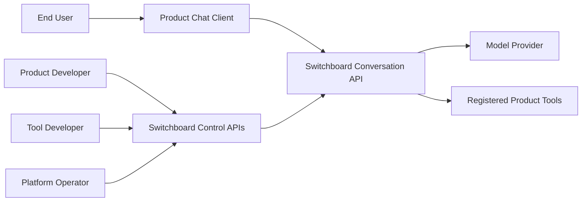
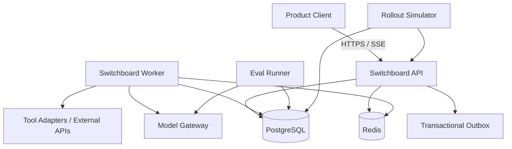
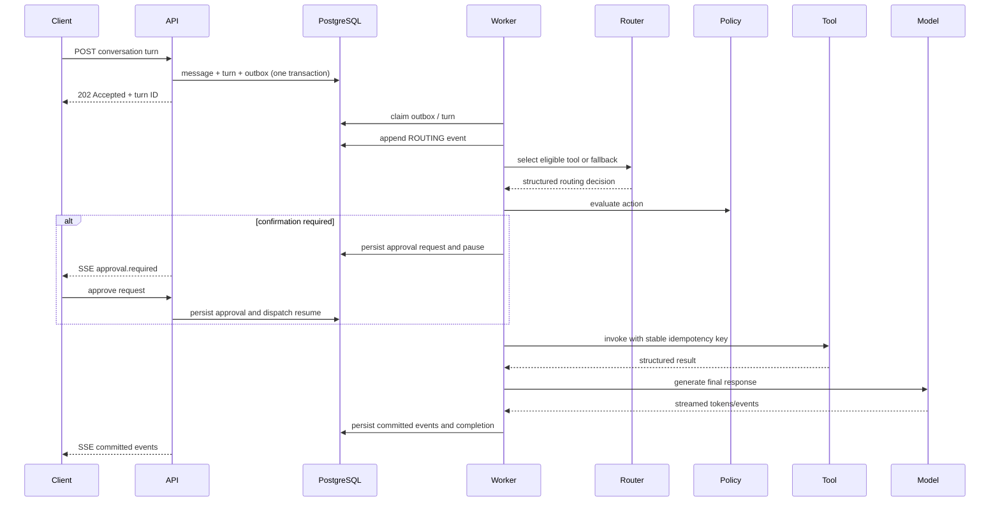
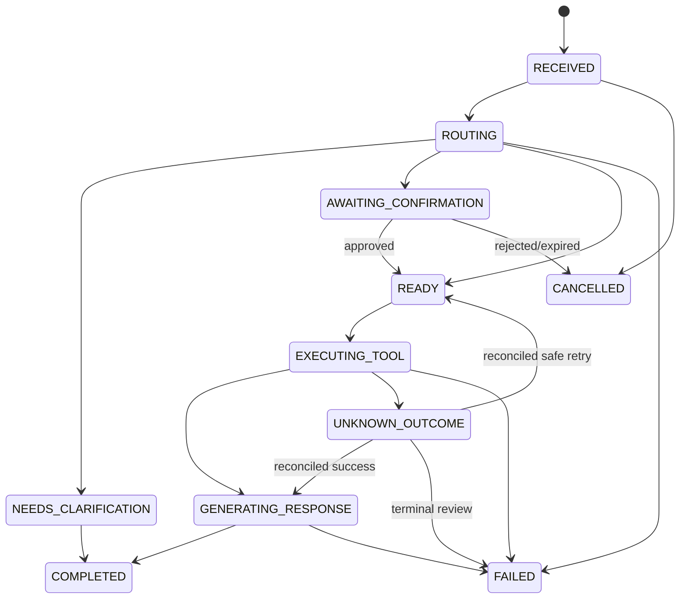
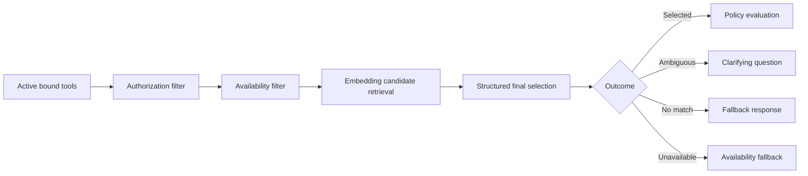

# Architecture

## Architectural style

Switchboard begins as a **modular monolith with a separate background worker**. This provides strong transactional boundaries and simple local operation while preserving modules that could later become independently deployed control-plane or data-plane services.

LangGraph is an orchestration adapter. Switchboard owns the public execution model, state machine, persistence, APIs, and guarantees.

## System context



## Target container view

This diagram includes later outbox, model, tool, evaluation, and rollout
components. The current Day 4 deployment subset is listed below.



## Control plane and data plane

### Control plane

- agent and tool registration;
- policy configuration;
- eval dataset and evaluator management;
- release creation and rollout transitions;
- disabling unhealthy tools;
- inspection and audit APIs.

### Data plane

- accept conversation turns;
- persist and dispatch work;
- load context;
- route tools;
- evaluate policies;
- wait for approval;
- invoke tools;
- call models;
- stream committed events;
- recover from retries and failure.

They initially share one codebase and database but have separate modules and contracts.

## Proposed modules

```text
src/switchboard/
├── domain/
│   ├── agents/
│   ├── conversations/
│   ├── execution/
│   ├── tools/
│   ├── policies/
│   ├── evaluation/
│   └── releases/
├── application/
│   ├── commands/
│   ├── queries/
│   ├── ports/
│   └── services/
├── adapters/
│   ├── api/
│   ├── persistence/
│   ├── orchestration/
│   ├── models/
│   ├── tools/
│   ├── streaming/
│   └── telemetry/
├── workers/
└── bootstrap/
```

## Target runtime turn flow

The following end-to-end outbox, worker, routing, policy, tool, and model flow is
the target architecture; Days 3–4 implement the durable event/SSE subset and
the provider-independent context assembly boundary described below.



## Durable dispatch

Target architecture, not yet implemented: the API transaction will commit:

1. user message;
2. `TurnExecution` in `RECEIVED`;
3. initial execution event;
4. outbox record.

The future worker will claim outbox records and advance the state machine. Day 3
does not yet provide the transactional outbox, durable claiming, or recovery.

## Execution state machine



Not every turn calls a tool. A direct-response path may move from routing to generation.

## Tool-routing pipeline



## Policy boundary

The policy engine receives a complete request context and returns one of:

- `ALLOW`;
- `DENY`;
- `REQUIRE_CONFIRMATION`;
- `REQUIRE_ELEVATED_APPROVAL`.

The executor never bypasses the policy result. Approvals are separate durable records with actor, scope, expiration, and argument fingerprint.

## Tool execution contract

Each invocation includes:

- immutable tool version;
- validated arguments;
- stable logical invocation ID and idempotency key;
- caller identity and delegated scopes;
- timeout and retry policy;
- trace context.

Each result maps to a platform error taxonomy. A timeout after dispatch of a mutation may become `UNKNOWN_OUTCOME`; it is not blindly retried.

## Streaming model

SSE is used because the primary direction is server-to-client event delivery.
Implemented events have monotonically increasing turn-local sequence numbers
allocated under a PostgreSQL turn-row lock. A reconnecting client supplies a
non-negative `Last-Event-ID`; the API treats it as an exclusive cursor, replays
committed events in order, and then follows newly committed events.

The Day 3 simulator emits stable `response.delta` chunks rather than exposing
provider token objects. A framework-independent replay service polls PostgreSQL
with short independent units of work, never sleeps or yields with a transaction
open, and closes after a terminal event. Redis is not required for correctness;
notification-assisted polling remains a future optimization.

`GET /api/v1/turns/{turn_id}/events` is read-only. Disconnecting or cancelling
one observer does not mutate execution or affect another observer. Production
retention and chunk-size tuning remain undefined.

## Context management

Every immutable `AgentVersion` owns a typed `ContextPolicy`: total model-window
tokens, reserved output, fixed instruction/tool overhead, maximum summary size,
and a mandatory recent-message floor. The application computes conversation
capacity as the model window minus reserved output and fixed overhead. It fails
explicitly when mandatory context cannot fit.

`BuildTurnContext` reconstructs a turn from messages only through that turn's
input-message sequence. A deterministic assembler keeps the newest contiguous
suffix and, when required, represents the omitted prefix with an immutable
`ConversationSummary`. Summaries start at sequence 1 and record conversation,
agent version, coverage, summarizer version, token-counter version, token count,
and creation time. They are derived artifacts, not visible conversation
messages or authorization evidence.

Snapshot reads, compatible-summary lookup, summarization, and summary writes use
separate boundaries. No database transaction remains open while a summarizer is
running. PostgreSQL uniqueness selects one authoritative artifact when
concurrent builders summarize the same provenance and coverage. The application
validates tenant ownership before reading or creating summaries.

The token counter and summarizer are ports. The current local summarizer is a
deterministic extractive simulator, not a production tokenizer or model-backed
semantic summarizer. Context construction is not yet wired into a real model
orchestration loop.

## Persistence ownership

- PostgreSQL: source of truth for configuration, conversation, execution, approval, audit, eval, and release state.
- Redis: ephemeral cache, rate-limit counters, leases, and connection coordination.
- Object storage: deferred; may later hold large eval artifacts or traces.

## Evaluation architecture

Offline evaluation is a control-plane job. It pins versions, runs deterministic checks first, optionally runs a calibrated judge, writes case-level results, compares against a baseline, and emits a pass/fail release decision.

Live rollout protection consumes operational signals. It does not rerun the entire offline golden dataset on every production turn.

## Deployment

Current Docker Compose services:

```text
api
worker
postgres
postgres-test (test profile)
redis
```

Planned additions:

```text
eval-runner
rollout-simulator
```

The API and worker use the same application/domain packages but different entry points.

## Scaling path

Only when measurement justifies it:

1. scale workers horizontally with database-backed claiming;
2. separate eval workloads from conversation workers;
3. move durable dispatch to a managed queue while preserving outbox semantics;
4. isolate control-plane APIs;
5. partition high-volume execution-event storage;
6. introduce multi-region ownership rules.

No microservice split is required merely to demonstrate seniority.


## Implementation status after Day 4

Implemented:

- one repository with separate API and worker entry points;
- inward domain/application/adapters/bootstrap dependency direction;
- FastAPI health and readiness endpoints;
- PostgreSQL and Redis runtime resources;
- SQLAlchemy Core persistence, Alembic, repository ports, and unit of work;
- durable versioned-agent, conversation, message, turn, and attempt records;
- atomic conversation start and PostgreSQL integration tests;
- immutable JSON-compatible execution events associated with logical turns and
  optional physical attempts;
- turn-local event sequence allocation, locked append, exclusive-cursor reads,
  lifecycle compare-and-set updates, and relational ownership constraints;
- deterministic simulated execution with durable chunks, atomic success output,
  and durable terminal failure after partial progress;
- framework-independent replay-then-tail polling over short transactions;
- reconnectable SSE with exact event IDs/types, compact JSON payloads, preflight
  validation, terminal closure, and independent observers.
- typed immutable context policies pinned to agent versions;
- durable prefix summaries with relational coverage, ownership, provenance, and
  concurrency authority constraints;
- deterministic bounded context selection that preserves the current input and
  configured recent-message floor;
- turn-pinned message cutoffs, compatible summary reuse, and short-transaction
  summary creation through provider-independent ports.

Planned but not yet implemented:

- public conversation commands;
- transactional outbox and worker claiming;
- durable worker recovery;
- real model-provider execution;
- Redis-assisted event notification;
- event retention and production chunk-size tuning;
- production tokenizers and semantic summarizers;
- summary chaining, retention, deletion, and large-history optimization;
- context integration into model orchestration;
- tool routing, policies, approvals, model adapters, evaluation, and rollout
  control.
