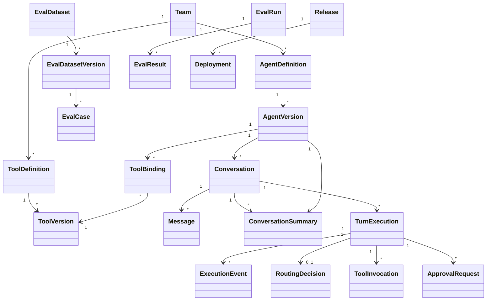

# Domain Model

## Aggregate overview



## Core entities

### Team

Ownership and isolation boundary.

**Important fields:** `team_id`, `name`, `status`, default quotas.  
**Invariant:** Team-owned resources cannot be accessed cross-team without an explicit platform capability.

### AgentDefinition

Stable identity of a product agent.

**Important fields:** `agent_id`, `team_id`, `name`, `description`, `status`.  
**Invariant:** Mutable display metadata may change, but behavior changes only through a new `AgentVersion`.

### AgentVersion

Immutable executable configuration.

**Contains:** prompt reference/content hash, model configuration, context policy, router configuration, policy bundle version, tool bindings, token/cost budgets.  
**Invariant:** Published versions are immutable and content-addressable or uniquely sequenced.

The implemented Day 4 subset persists a typed `ContextPolicy` containing model
window, reserved output, fixed overhead, maximum summary size, and minimum
recent-message count. Prompt, model, tool, router, and policy-bundle fields
remain target capabilities.

### ToolDefinition

Stable identity and ownership of a tool capability.

**Implemented fields:** `tool_definition_id`, `team_id`, normalized `tool_key`,
and creation time. The key is unique within its team.

### ToolVersion

Immutable tool contract and execution configuration.

**Implemented content:** bounded input/output Draft 2020-12 schemas, display name,
description, effect type, required scopes, timeout, retry policy, idempotency and
reconciliation declarations, local adapter key, redaction paths, version number,
and canonical content hash. Ownership is inherited from `ToolDefinition`, not
duplicated in caller-controlled manifest JSON. Health strategy remains deferred.

**Invariant:** Manifest content is recursively immutable. Schema or behavior
changes require a new positive version number allocated under the definition
lock.

### ToolVersionState

Separately mutable lifecycle state for one exact `ToolVersion`.

**Contains:** `DRAFT`, `ACTIVE`, `DEPRECATED`, or `DISABLED` status, revision,
timestamps, and the exact conformance run authorizing activation.

**Invariant:** Lifecycle transitions use revision compare-and-set semantics;
`ACTIVE` and `DEPRECATED` states retain successful activation evidence, and
`DISABLED` is terminal.

### ToolConformanceRun

Immutable complete result for deterministic adapter contract checks, with
ordered case-level results containing only status, duration, and safe diagnostic
codes. Tested values and provider messages are not persisted.

**Invariant:** Activation requires a committed successful run for the exact tool
version. Adapter calls occur outside database transactions; a run and all cases
are persisted together afterward.

### AgentToolBinding

Immutable link from one exact `AgentVersion` to one exact `ToolVersion` and its
stable definition.

**Invariant:** One agent version binds at most one version of a stable tool
definition. Adding a binding clones the base agent version and its existing
bindings rather than mutating it. New bindings require current `ACTIVE` state.

### Conversation

Long-lived interaction pinned to one `AgentVersion` for the initial design.

**Invariant:** Conversation history is durable and ordered. Agent upgrades require an explicit migration or new conversation.

### Message

User, assistant, tool, or system-visible message record. Raw confidential model reasoning is not a message type.

The current implementation supports user and assistant roles. Messages are
immutable and ordered by a positive conversation-local sequence.

### ConversationSummary

Immutable derived representation of an older conversation prefix. It records
conversation and agent-version identity, inclusive coverage, content, estimated
tokens, summarizer version, token-counter version, and creation time.

**Invariant:** Phase 1 coverage is exactly `[1, through_sequence]`; endpoints
must be messages from the same conversation. One authoritative artifact exists
for the same conversation, agent version, coverage, summarizer version, and
token-counter version. A summary does not replace or mutate visible messages and
does not contain private model reasoning.

### TurnExecution

Durable lifecycle of processing one user turn.

**Key fields:** `turn_id`, `conversation_id`, `status`, `created_at`,
`completed_at`, and `next_event_sequence`. Physical retries are represented by
separate `TurnAttempt` records.
**Invariant:** State changes follow the approved transition graph. The Day 3
simulator commits lifecycle changes and their public execution events atomically.

### ExecutionEvent

Immutable audit and replay record owned by one logical turn and optionally linked
to the physical attempt that emitted it.

**Implemented kinds:** `turn.started`, `response.delta`, `turn.completed`, and
`turn.failed`. Payloads are recursively immutable and JSON-compatible; they
contain stable public data and never private model reasoning.
**Invariant:** Positive sequence numbers are unique and monotonic within a turn.
An event attempt, when present, must belong to the same turn. A turn has at most
one start event and one terminal event.

### RoutingDecision

Structured result of tool selection.

**Contains:** router version, outcome, selected tool version, candidate scores, confidence, reason code, eligible-tool snapshot reference.  
**Invariant:** A selected tool must have been eligible at decision time.

### ApprovalRequest

Durable authorization/confirmation artifact.

**Contains:** requested action summary, argument fingerprint, required actor, status, expiry, decision actor/time.  
**Invariant:** Approval applies only to the exact fingerprint and policy context; changed arguments invalidate it.

### ToolInvocation

One logical invocation, possibly with multiple delivery attempts.

**Contains:** logical invocation ID, stable idempotency key, tool version, arguments, status, dispatch attempts, normalized result, external operation reference.  
**Invariant:** Retries of one logical invocation reuse its idempotency key.

### EvalDatasetVersion

Immutable collection of cases and metadata.

### EvalRun

Pins dataset, agent, router, tools, evaluator, judge, seed, and runtime configuration.

**Invariant:** An aggregate score without case-level results and pinned versions is not a valid run.

### Release and Deployment

Release identifies a candidate configuration bundle. Deployment records stage, traffic allocation, baseline, live metrics, and rollback outcome.

## Value objects and enums

- `ToolEffect`: `READ_ONLY`, `MUTATING`, `EXTERNAL_SIDE_EFFECT`, `PRIVILEGED`
- `RoutingOutcome`: `SELECTED`, `NO_MATCH`, `AMBIGUOUS`, `NEEDS_CLARIFICATION`, `TOOL_UNAVAILABLE`, `NOT_AUTHORIZED`
- `PolicyDecision`: `ALLOW`, `DENY`, `REQUIRE_CONFIRMATION`, `REQUIRE_ELEVATED_APPROVAL`
- `ToolOutcome`: `SUCCEEDED`, `VALIDATION_FAILED`, `UNAUTHORIZED`, `RATE_LIMITED`, `RETRIABLE_FAILURE`, `TERMINAL_FAILURE`, `TIMED_OUT`, `UNKNOWN_OUTCOME`
- `ToolLifecycle`: `DRAFT`, `ACTIVE`, `DEPRECATED`, `DISABLED`
- `ReleaseStage`: `DRAFT`, `OFFLINE_EVALUATION`, `SHADOW`, `CANARY`, `FULL`, `ROLLED_BACK`

## Important invariants

1. A conversation references one immutable agent version.
2. A tool invocation references one immutable tool version.
3. A selected tool was bound, authorized, active, and healthy at decision time.
4. A mutation cannot dispatch without an allowing policy decision and any required approval.
5. Approval covers an argument fingerprint, not merely a tool name.
6. A logical invocation owns one stable idempotency key across attempts.
7. Unknown external outcomes are reconciled before retry.
8. Critical state is persisted before an externally visible event is acknowledged.
9. Execution events are append-only.
10. Eval and release decisions identify their exact input versions.
11. Context for a turn reads no message after that turn's input-message sequence.
12. Mandatory recent context is never silently dropped to satisfy a token budget.

## Open design questions to resolve during development

- Should conversations remain pinned forever or support explicit agent-version migration?
- How should durable streamed output be chunked to balance write cost and recovery granularity?
- Is `TurnExecution` one aggregate with all invocations, or should long workflows introduce a separate workflow aggregate?
- Which reconciliation capabilities are mandatory for external-side-effect tools?
- How long should approval requests and execution events be retained?


## Implementation status after Day 5

Implemented durable entities:

```text
AgentDefinition
└── AgentVersion
    └── ContextPolicy

Conversation
├── Message
├── ConversationSummary
└── Turn
    ├── TurnAttempt
    └── ExecutionEvent

Team
└── ToolDefinition
    └── ToolVersion
        ├── ToolVersionState
        └── ToolConformanceRun
            └── ToolConformanceCaseResult

AgentVersion
└── AgentToolBinding
    └── ToolVersion
```

Implemented invariants:

- messages have unique positive sequence numbers within a conversation;
- message ordering is deterministic and allocated under a conversation row lock;
- conversation history is represented by immutable domain objects;
- a conversation stores a default agent version and every turn pins the actual version used;
- one input message creates at most one logical turn;
- attempts are uniquely ordered within a turn;
- terminal states require completion timestamps;
- starting a conversation, first message, first turn, and first attempt is atomic;
- a turn's input message must belong to the same conversation;
- execution-event payloads are immutable JSON-compatible public values;
- event sequences are turn-local, positive, unique, and allocated under a row lock;
- event-attempt ownership is enforced relationally;
- simulated lifecycle transitions use compare-and-set updates;
- assistant output and terminal success are committed atomically;
- partial simulated output remains replayable before a durable failure event;
- SSE replay uses an exclusive cursor and delivers committed events only.
- context policies are immutable and pinned through each turn's agent version;
- context reads stop at the turn input-message sequence;
- bounded assembly preserves the current input and configured recent floor;
- omitted older history is represented by a provenance-bearing prefix summary;
- summary coverage endpoints belong to the same conversation;
- concurrent summary creation converges on one authoritative artifact;
- summarization runs outside database transactions and failed or cancelled
  summarization persists no partial artifact.
- tool definitions own unique normalized keys within a team;
- immutable tool versions contain frozen manifest JSON and deterministic hashes;
- effect, retry, idempotency, reconciliation, scope, timeout, and redaction
  declarations are bounded and validated before persistence;
- lifecycle state is separate and updated through revision compare-and-set;
- activation requires successful conformance for the exact version;
- conformance calls run outside transactions and complete case results persist
  atomically without tested values or provider messages;
- binding an active version creates a new immutable agent version and copies
  existing bindings under lock;
- eligible manifests require an exact binding, matching team, `ACTIVE` state,
  and successful activation conformance.

Not implemented yet: transactional outbox dispatch, durable worker claiming and
recovery, real model-provider execution, Redis event notifications, event
retention, production chunk tuning, production token counting, semantic
summarization, summary retention/chaining, model-loop context integration,
routing decisions, runtime authorization/health filtering, durable tool
invocations, production adapters, approvals, evaluation entities, and release
entities.
