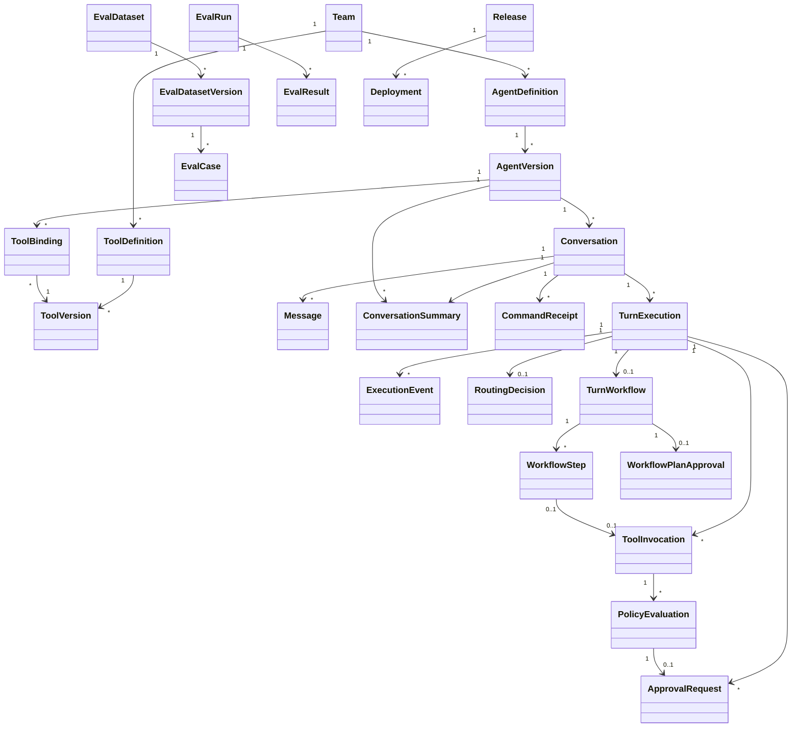

# Domain Model

## Aggregate overview



## Core entities

### Team

Ownership and isolation boundary.

**Important fields:** `team_id`, `name`, `status`, default quotas.  
**Invariant:** Team-owned resources cannot be accessed cross-team without an explicit platform capability.

### AgentDefinition

Stable identity of a product agent.

**Important fields:** `agent_id`, `team_id`, `name`, `description`, `status`.  
**Invariant:** Mutable display metadata may change, but behavior changes only through a new `AgentVersion`.

### AgentVersion

Immutable executable configuration.

**Contains:** prompt reference/content hash, model configuration, context policy, router configuration, policy bundle version, tool bindings, token/cost budgets.  
**Invariant:** Published versions are immutable and content-addressable or uniquely sequenced.

The implemented Day 4 subset persists a typed `ContextPolicy` containing model
window, reserved output, fixed overhead, maximum summary size, and minimum
recent-message count. Prompt, model, tool, router, and policy-bundle fields
remain target capabilities.

### ToolDefinition

Stable identity and ownership of a tool capability.

**Implemented fields:** `tool_definition_id`, `team_id`, normalized `tool_key`,
and creation time. The key is unique within its team.

### ToolVersion

Immutable tool contract and execution configuration.

**Implemented content:** bounded input/output Draft 2020-12 schemas, display name,
description, effect type, required scopes, timeout, retry policy, idempotency and
reconciliation declarations, local adapter key, redaction paths, version number,
and canonical content hash. Ownership is inherited from `ToolDefinition`, not
duplicated in caller-controlled manifest JSON. Health strategy remains deferred.

**Invariant:** Manifest content is recursively immutable. Schema or behavior
changes require a new positive version number allocated under the definition
lock.

### ToolVersionState

Separately mutable lifecycle state for one exact `ToolVersion`.

**Contains:** `DRAFT`, `ACTIVE`, `DEPRECATED`, or `DISABLED` status, revision,
timestamps, and the exact conformance run authorizing activation.

**Invariant:** Lifecycle transitions use revision compare-and-set semantics;
`ACTIVE` and `DEPRECATED` states retain successful activation evidence, and
`DISABLED` is terminal.

### ToolConformanceRun

Immutable complete result for deterministic adapter contract checks, with
ordered case-level results containing only status, duration, and safe diagnostic
codes. Tested values and provider messages are not persisted.

**Invariant:** Activation requires a committed successful run for the exact tool
version. Adapter calls occur outside database transactions; a run and all cases
are persisted together afterward.

### AgentToolBinding

Immutable link from one exact `AgentVersion` to one exact `ToolVersion` and its
stable definition.

**Invariant:** One agent version binds at most one version of a stable tool
definition. Adding a binding clones the base agent version and its existing
bindings rather than mutating it. New bindings require current `ACTIVE` state.

### Conversation

Long-lived interaction pinned to one `AgentVersion` for the initial design.

**Invariant:** Conversation history is durable and ordered. Agent upgrades require an explicit migration or new conversation.

### Message

User, assistant, tool, or system-visible message record. Raw confidential model reasoning is not a message type.

The current implementation supports user and assistant roles. Messages are
immutable and ordered by a positive conversation-local sequence.

### ConversationSummary

Immutable derived representation of an older conversation prefix. It records
conversation and agent-version identity, inclusive coverage, content, estimated
tokens, summarizer version, token-counter version, and creation time.

**Invariant:** Phase 1 coverage is exactly `[1, through_sequence]`; endpoints
must be messages from the same conversation. One authoritative artifact exists
for the same conversation, agent version, coverage, summarizer version, and
token-counter version. A summary does not replace or mutate visible messages and
does not contain private model reasoning.

### CommandReceipt

Immutable durable authority for one accepted public command. It stores team,
operation, scope, SHA-256 idempotency-key hash, a versioned canonical request
fingerprint, immutable result identifiers, and creation time. Create commands
use a fixed scope; continuation commands use conversation identity; approval
decisions use approval identity and store the deciding actor and decision.

**Invariant:** One receipt exists per team, operation, scope, and key hash.
Receipt insertion and the accepted message/turn graph commit atomically.
Identical fingerprints replay the original result; a different fingerprint is
a conflict. Raw keys and copied message content are never stored in receipts.

### TurnExecution

Durable lifecycle of processing one user turn.

**Key fields:** `turn_id`, `conversation_id`, `status`, `created_at`,
`completed_at`, and `next_event_sequence`. Physical retries are represented by
separate `TurnAttempt` records.
**Invariant:** State changes follow the approved transition graph. Execution
workflows commit lifecycle changes and their public execution events atomically.
The implemented turn lifecycle includes `RECEIVED`, `RUNNING`, nonterminal
`AWAITING_CONFIRMATION`, and terminal `COMPLETED`, `FAILED`, or `CANCELLED`;
attempts mirror the pause and cancellation boundary.

### ExecutionEvent

Immutable audit and replay record owned by one logical turn and optionally linked
to the physical attempt that emitted it.

**Implemented kinds:** `turn.started`, `response.delta`, `approval.required`,
`approval.resolved`, `tool.started`, `tool.completed`, `tool.failed`,
`workflow.planned`, `workflow.resumed`, `workflow.terminal`, `turn.completed`,
`turn.failed`, and terminal `turn.cancelled`. Workflow events do not terminate
the public turn stream. Payloads
are recursively immutable and JSON-compatible. Tool events expose only stable
invocation/tool identifiers and safe failure codes; no public event contains
arguments, tool output, prompts, provider exceptions, or private reasoning.
**Invariant:** Positive sequence numbers are unique and monotonic within a turn.
An event attempt, when present, must belong to the same turn. A turn has at most
one start event and one terminal event.

### RoutingDecision

Structured result of tool selection.

**Contains:** router version, outcome, selected tool version, candidate scores, confidence, reason code, eligible-tool snapshot reference.  
**Invariant:** A selected tool must have been eligible at decision time.

### ApprovalRequest

Durable fingerprint-bound human confirmation linked to one immutable
`PolicyEvaluation` and exact `ToolInvocation`.

**Contains:** team/requester identity, value-free safe action summary, internal
`action-v1` fingerprint, `PENDING|APPROVED|REJECTED|EXPIRED|CONSUMED` status,
expiry, decision actor/time, and consumption time.

**Invariant:** Approval applies only to the exact requester, team, agent/tool
versions, effect, environment, policy version, and canonical arguments. Public
reads/events omit arguments and digest. Rejection/expiry never dispatches.

### TurnWorkflow

Framework-independent durable business progress for the bounded Day 9 workflow.
It belongs to exactly one turn and attempt and stores lifecycle, positive plan
version, optional frozen `workflow-plan-v1` fingerprint, optional plan approval,
and optional terminal assistant message.

**Lifecycle:** `DISCOVERY_PENDING -> DISCOVERY_RUNNING -> PLANNING`, then either
`AWAITING_CONFIRMATION -> RUNNING -> COMPLETING` or, for an empty mutation plan,
directly `COMPLETING`. Terminal states are `DISCOVERY_FAILED`, `CANCELLED`,
`COMPLETED`, `FAILED`, and `REVIEW_REQUIRED`.

**Invariant:** Day 9 permits one workflow per turn. PostgreSQL is authoritative;
framework checkpoints are derived state. Frozen plan identity and executable
step content cannot change.

### WorkflowStep

One ordered typed unit inside a `TurnWorkflow`: `DISCOVERY_TOOL`,
`MUTATION_TOOL`, or `FINAL_RESPONSE`. Tool steps link to exact invocations and
the final step links to its assistant message. Immediate-predecessor identity
and number encode the bounded sequential dependency.

**Lifecycle:** `PENDING -> RUNNING -> SUCCEEDED|FAILED|UNKNOWN`, plus
`PENDING -> SKIPPED` for undispatched later mutations.

**Invariant:** Step numbers are positive and unique per workflow, predecessor
ownership and adjacency are relationally enforced, and terminal evidence is
immutable. General DAGs, parallel-ready steps, and post-freeze insertion are
invalid.

### WorkflowPlanApproval

One value-free confirmation over the exact ordered frozen mutation plan. It
stores team/requester identity, `workflow-plan-v1` fingerprint, ordered safe
action summaries, expiry, decision lifecycle, and its workflow target.

**Invariant:** The fingerprint binds workflow/plan identity and the ordered
per-mutation invocation identities and `action-v1` fingerprints. Public reads
expose counts, step numbers, effects, tool IDs, and argument field names only;
they never expose argument values or either digest.

### PolicyEvaluation

Immutable audit fact recording trusted policy inputs, versioned decision and
reason code, exact action fingerprint, and evaluation time. `ALLOW` is valid
only for read-only effects; `REQUIRE_CONFIRMATION` only for mutating effects;
denied external-side-effect and privileged proposals have no invocation.

### ToolInvocation

One durable logical invocation owned by an exact turn attempt and exact tool
version. It records a positive turn-local invocation number, canonical immutable JSON
arguments, a stable platform-generated idempotency key, the authorized scope
snapshot, lifecycle timestamps, and either a normalized result or safe failure
code.

The implemented lifecycle is
`PENDING → RUNNING → SUCCEEDED|FAILED|UNKNOWN` for read-only calls and
`PENDING → AWAITING_CONFIRMATION → RUNNING → SUCCEEDED|FAILED|UNKNOWN` for approved
mutations. Rejection/expiry moves awaiting invocations to `CANCELLED` without
starting. The exact eligible tool and fingerprint are locked/revalidated before
approval consumption; consumption, `RUNNING`, resumed turn/attempt state, and
`tool.started` are atomic. Adapter execution holds no database transaction.

**Invariants:** Day 9 permits multiple invocations per attempt while preserving
positive unique turn-local ordering. Composite
foreign keys enforce attempt/turn and tool-version/definition ownership. Stable
keys are globally unique. Public events contain only stable invocation/tool IDs
and safe failure codes—never arguments, output, prompts, provider exceptions, or
private reasoning. An uncertain post-dispatch result is durable evidence and is
never blindly retried. Delivery-attempt modeling and outcome reconciliation are
deferred.

### EvalDatasetVersion

Immutable collection of cases and metadata.

### EvalRun

Pins dataset, agent, router, tools, evaluator, judge, seed, and runtime configuration.

**Invariant:** An aggregate score without case-level results and pinned versions is not a valid run.

### Release and Deployment

Release identifies a candidate configuration bundle. Deployment records stage, traffic allocation, baseline, live metrics, and rollback outcome.

## Value objects and enums

- `ToolEffect`: `READ_ONLY`, `MUTATING`, `EXTERNAL_SIDE_EFFECT`, `PRIVILEGED`
- `RoutingOutcome`: `SELECTED`, `NO_MATCH`, `AMBIGUOUS`, `NEEDS_CLARIFICATION`, `TOOL_UNAVAILABLE`, `NOT_AUTHORIZED`
- `PolicyDecision`: `ALLOW`, `DENY`, `REQUIRE_CONFIRMATION`, `REQUIRE_ELEVATED_APPROVAL`
- `ToolOutcome`: `SUCCEEDED`, `VALIDATION_FAILED`, `UNAUTHORIZED`, `RATE_LIMITED`, `RETRIABLE_FAILURE`, `TERMINAL_FAILURE`, `TIMED_OUT`, `UNKNOWN_OUTCOME`
- `ToolLifecycle`: `DRAFT`, `ACTIVE`, `DEPRECATED`, `DISABLED`
- `ReleaseStage`: `DRAFT`, `OFFLINE_EVALUATION`, `SHADOW`, `CANARY`, `FULL`, `ROLLED_BACK`

## Important invariants

1. A conversation references one immutable agent version.
2. A tool invocation references one immutable tool version.
3. A selected tool was bound, authorized, active, and healthy at decision time.
4. A mutation cannot dispatch without an allowing policy decision and any required approval.
5. Approval covers an argument fingerprint, not merely a tool name.
6. A logical invocation owns one stable idempotency key across attempts.
7. Unknown external outcomes block retry until future reconciliation.
8. Critical state is persisted before an externally visible event is acknowledged.
9. Execution events are append-only.
10. Eval and release decisions identify their exact input versions.
11. Context for a turn reads no message after that turn's input-message sequence.
12. Mandatory recent context is never silently dropped to satisfy a token budget.

## Open design questions to resolve during development

- Should conversations remain pinned forever or support explicit agent-version migration?
- How should durable streamed output be chunked to balance write cost and recovery granularity?
- Which reconciliation capabilities are mandatory for external-side-effect tools?
- How long should approval requests and execution events be retained?


## Implementation status after Day 9

Implemented durable entities:

```text
AgentDefinition
└── AgentVersion
    └── ContextPolicy

Conversation
├── Message
├── ConversationSummary
├── CommandReceipt
└── Turn
    ├── TurnAttempt
    ├── ExecutionEvent
    ├── ToolInvocation
        ├── PolicyEvaluation
        └── ApprovalRequest
    └── TurnWorkflow
        ├── WorkflowStep
        └── WorkflowPlanApproval

Team
└── ToolDefinition
    └── ToolVersion
        ├── ToolVersionState
        └── ToolConformanceRun
            └── ToolConformanceCaseResult

AgentVersion
└── AgentToolBinding
    └── ToolVersion
```

Implemented invariants:

- messages have unique positive sequence numbers within a conversation;
- message ordering is deterministic and allocated under a conversation row lock;
- conversation history is represented by immutable domain objects;
- a conversation stores a default agent version and every turn pins the actual version used;
- one input message creates at most one logical turn;
- attempts are uniquely ordered within a turn;
- terminal states require completion timestamps;
- starting a conversation, first message, first turn, and first attempt is atomic;
- create and continuation commands atomically persist a hashed-key receipt with
  the message, turn, and pending attempt;
- receipt uniqueness is the concurrency authority for idempotent replay;
- conflicting key reuse creates no second graph, and failed commands leave no
  partial receipt;
- public history reads use bounded exclusive sequence cursors;
- team ownership failures and unknown resources share a non-disclosing API
  response;
- a turn's input message must belong to the same conversation;
- execution-event payloads are immutable JSON-compatible public values;
- event sequences are turn-local, positive, unique, and allocated under a row lock;
- event-attempt ownership is enforced relationally;
- simulated lifecycle transitions use compare-and-set updates;
- assistant output and terminal success are committed atomically;
- partial simulated output remains replayable before a durable failure event;
- SSE replay uses an exclusive cursor and delivers committed events only.
- context policies are immutable and pinned through each turn's agent version;
- context reads stop at the turn input-message sequence;
- bounded assembly preserves the current input and configured recent floor;
- omitted older history is represented by a provenance-bearing prefix summary;
- summary coverage endpoints belong to the same conversation;
- concurrent summary creation converges on one authoritative artifact;
- summarization runs outside database transactions and failed or cancelled
  summarization persists no partial artifact.
- tool definitions own unique normalized keys within a team;
- immutable tool versions contain frozen manifest JSON and deterministic hashes;
- effect, retry, idempotency, reconciliation, scope, timeout, and redaction
  declarations are bounded and validated before persistence;
- lifecycle state is separate and updated through revision compare-and-set;
- activation requires successful conformance for the exact version;
- conformance calls run outside transactions and complete case results persist
  atomically without tested values or provider messages;
- binding an active version creates a new immutable agent version and copies
  existing bindings under lock;
- eligible manifests require an exact binding, matching team, `ACTIVE` state,
  and successful activation conformance.
- bounded context and eligible read-only descriptors feed a framework-isolated
  direct-or-one-tool orchestration graph;
- tool invocations have stable identity, canonical arguments, locked lifecycle
  transitions, relational ownership, and safe public events;
- no transaction spans a model or tool adapter call;
- final assistant output, successful lifecycle, and `turn.completed` are atomic,
  while committed partial progress is preserved before durable failure.
- pure policy evaluation retains immutable audit for allow, deny, and
  confirmation-required decisions;
- mutating proposals persist exact invocation/evaluation/approval identity and
  enter explicit awaiting lifecycles without dispatch;
- approval decisions are actor-bound, idempotent, expiring, and selected through
  PostgreSQL locks/compare-and-set updates;
- final resume revalidates the exact action fingerprint and commits consumption,
  running lifecycle, and `tool.started` before adapter execution;
- rejection/expiry produces cancelled invocation/attempt/turn state and terminal
  replayable events without adapter execution.
- one turn owns at most one bounded sequential workflow with positive ordered
  steps and immediate-predecessor constraints;
- one attempt may own multiple positive ordered invocations while stable keys
  and attempt/turn ownership remain enforced;
- discovery intent commits before execution and a trusted bounded plan freezes
  before mutation approval or dispatch;
- plan approval binds the ordered exact mutation fingerprints and exposes only
  value-free summaries;
- recreated runners skip terminal steps and persist each mutation result before
  selecting another;
- known failure skips later mutations, while uncertain post-dispatch outcomes
  persist `UNKNOWN` invocation/step evidence and end in `REVIEW_REQUIRED`;
- safe additive workflow events preserve existing turn-stream terminal rules.

Not implemented yet: transactional outbox dispatch, automatic durable worker
claiming/recovery, unknown-outcome reconciliation, real model-provider
execution, Redis event notifications, event
retention, production chunk tuning, production token counting, semantic
summarization, summary retention/chaining, semantic routing decisions,
production authorization/health filtering, elevated/external-effect approval,
durable invocation recovery/retries, production adapters, evaluation entities,
and release entities.
